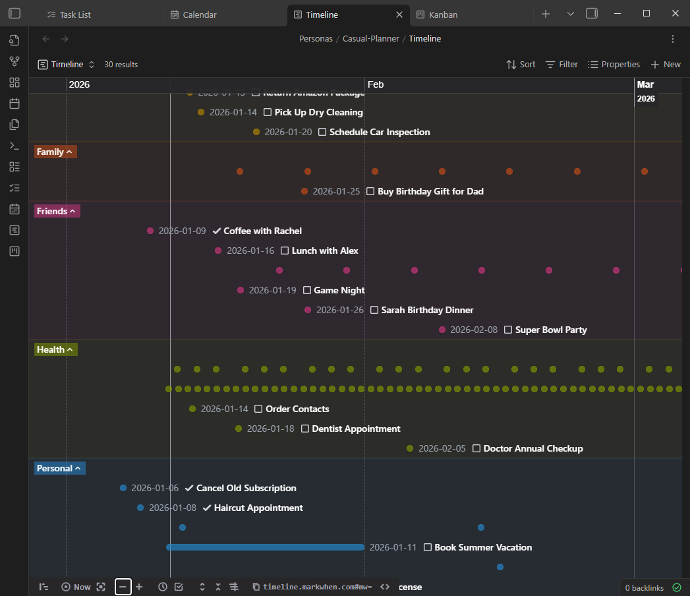

# Timeline View

Visualize your projects on an interactive timeline.

## Features

- Gantt-style visualization
- Powered by Markwhen
- Interactive zooming and panning
- Click to edit items
- Theme-aware styling

## How It Works

The Timeline view converts your items into Markwhen format:

1. Items with start and end dates become events
2. Events are grouped by calendar/project
3. The timeline renders the events visually

## Date Requirements

For items to appear on the timeline:

- Must have a **start date** (`date_start_scheduled`)
- Optionally have an **end date** (`date_end_scheduled`)
- Items without dates won't appear

## Interactions

### Navigation

- **Zoom** - Scroll to zoom in/out
- **Pan** - Click and drag to move
- **Fit** - Double-click to fit all events

### Editing

- Click an event to open the Item Modal
- Change dates directly in the modal

## Mobile Support

- Touch gestures for panning
- Pinch to zoom
- Tap events to edit

## Technical Notes

The Timeline view uses an iframe for isolation:

- Timeline HTML is bundled for mobile compatibility
- Communication uses Local Procedure Calls (LPC)
- Theme colors sync with Obsidian
